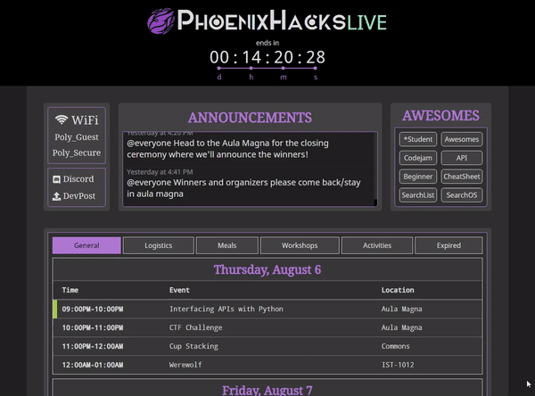
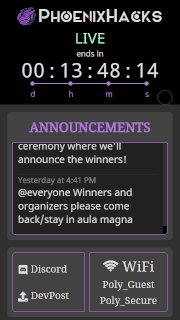

# PhoenixHacks 2020 Live Site

> A web app live site built for PhoenixHacks (Spring 2020).

The PhoenixHacks LIVE web app is a real-time information hub for hackers to refer to during PhoenixHacks.  
Kickstarted with create-react-app.  Design inspired by other hackathon live sites.

 

### Built With

- **Framework:** [React](https://reactjs.org/)
- **Hosting:** [Github Pages](https://pages.github.com/)

### Installation & Usage

`git clone https://github.com/PhoenixHacks/2020-live-web.git` to a desired project directory.

`cd` into the project directory.

`yarn install` to install all dependencies.

#### Development Environment

`yarn start` to run the app in development mode.

Open [`http://localhost:3000`](http://localhost:3000/) to view it in the browser.

#### Production Environment

`yarn build` to build the app for production to the `build` folder.  
It correctly bundles React in production mode and optimizes the build for the best performance.

The build is minified and the filenames include the hashes.  
The app is ready to be deployed!

`yarn deploy` to deploy the app to GitHub pages.

------

### What is [PhoenixHacks](http://phoenixhacks.com/)?

PhoenixHacks is an 24-hour Hackathon hosted at Florida Polytechnic University.

#### Roadmap

See the [open issues](https://github.com/PhoenixHacks/2020-live-web/issues) for a list of proposed features (and known issues).

#### Contributing

Contributions are what make the open source community such an amazing place to be learn, inspire, and create. Any contributions you make are **greatly appreciated**.

1. Fork the Project
2. Create your Feature Branch (`git checkout -b feature/AmazingFeature`)
3. Commit your Changes (`git commit -m 'Add some AmazingFeature'`)
4. Push to the Branch (`git push origin feature/AmazingFeature`)
5. Open a Pull Request

#### License

Distributed under the MIT License. See `LICENSE` for more information.

#### Contact

Justin McGettigan - [@jwmcgettigan](https://www.github.com/jwmcgettigan) - [jwmcgettigan@gmail.com](mailto:jwmcgettigan@gmail.com)

// Add a means of contact for the PhoenixHacks team.  [info.phoenixhacks.com](mailto:info@phoenixhacks.com)?
// Add a contact point for the current lead of PhoenixHacks?

The Repo - https://github.com/PhoenixHacks/2020-live-web

#### Acknowledgements

- [@Dysnomia1](https://github.com/Dysnomia1) for design assistance | [calvinhecker88@gmail.com](mailto:calvinhecker88@gmail.com)
- [MangoHacks2019 Live Site](https://github.com/MangoHacks/mango2019-live) for inspiration regarding the announcements and timer features.
